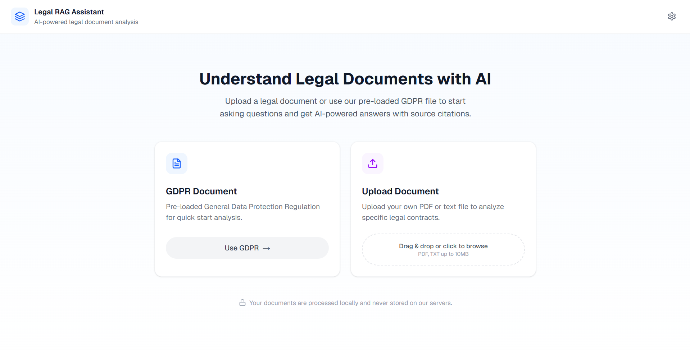
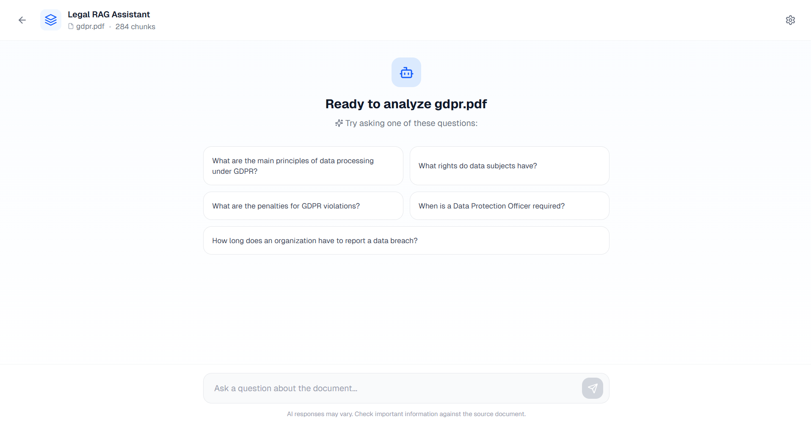

# Legal RAG Assistant

AI-powered legal document analysis to help you understand legal documents more easily and accurately.

[](https://legal-rag-demo.vercel.app/)

### 📸 Project Preview



### Chat Interface



## 🏗️ Architecture

```
PDF Document
    ↓
Parse & Chunk (PyMuPDF + Hierarchical chunking)
    ↓
Generate Embeddings (paraphrase-multilingual-MiniLM-L12-v2)
    ↓
Store in Vector DB (FAISS)
    ↓
User Query → Semantic Search → Retrieve Top-K Chunks
    ↓
LLM (Gemini) + Context → Generate Answer
```

## 📊 Evaluation

A span-based eval harness lives in [`backend/eval/`](backend/eval). Ground truth is the
sentence that answers each question, located verbatim in the PDF, so chunking strategies
are scored in the same coordinate space rather than by comparing metadata labels.
20 questions across all 11 GDPR chapters (12 factual, 4 multi-hop, 2 unanswerable,
2 out-of-scope).

**Ceiling ladder** (k=3). Fix the first rung that breaks:

```
                 hierarchical              recursive-512-128
parse            99 articles, 11 chapters  99 articles, 11 chapters   OK
chunk            n=99   coverage=1.00      n=1012 coverage=1.00       OK
retrieve         hit@3=0.38  MRR=0.28      hit@3=0.12  MRR=0.09       <- breaks here
                 median gold rank 5        median gold rank 23
generate         pending judge validation
```

**Chunking ablation** (retrieval, answerable questions, n=16 paired):

| k | hierarchical hit@k | recursive-512-128 hit@k | hier. only / recur. only | McNemar exact p |
|---|---|---|---|---|
| 1 | 0.19 | 0.06 | 3 / 1 | 0.625 |
| 3 | 0.38 | 0.12 | 5 / 1 | 0.219 |
| 5 | 0.44 | 0.12 | 6 / 1 | 0.125 |

Hierarchical (article-level) chunking retrieves the answering passage more often at every
k, but with 16 paired questions the difference is not statistically significant (p ≥ 0.125),
and part of its edge comes from each article chunk being a ~4× larger target than a
512-character window. The shared bottleneck is the retriever itself: the answering passage
sits at median rank 5 for hierarchical (k is too small) and rank 23 for recursive
(embeddings do not surface it).

Full report, slices by question type and chapter, and limitations:
[`backend/eval/results/REPORT.md`](backend/eval/results/REPORT.md).
Generation metrics are withheld until the LLM judge is validated against human labels
(Cohen's κ ≥ 0.6).

```bash
cd backend
pip install -r requirements-dev.txt
python -m eval.ablations.chunking --fast   # retrieval only, no LLM, ~1 min
python -m eval.ablations.chunking --full   # plus generation and judge (needs GEMINI_API_KEY)
python -m eval.report
```

## 🔧 Tech Stack

**Backend:**
- Python, FastAPI
- PyMuPDF, Sentence Transformers, FAISS
- Google Gemini API
- Deployed on Railway

**LLM**: Google Gemini API

**Frontend:**
- Next.js, React, TypeScript
- Tailwind CSS
- Deployed on Vercel

## 💡 Usage

1. Upload a PDF document (e.g., GDPR) or use pre-loaded one
2. Ask questions in natural language
3. Get AI answers with source citations

**Example questions:**
- What is personal data according to GDPR?
- What are the penalties for violations?
- What are data subject rights?

## 🎥 Demo

**Live:** [Try it here](https://legal-rag-demo.vercel.app/)

## 📝 License

MIT

## 👤 Author

**Tatyana Ignatenko**  
[GitHub](https://github.com/TanyaIgnatenko) • [LinkedIn](https://www.linkedin.com/in/tatyana-ignatenko/)
